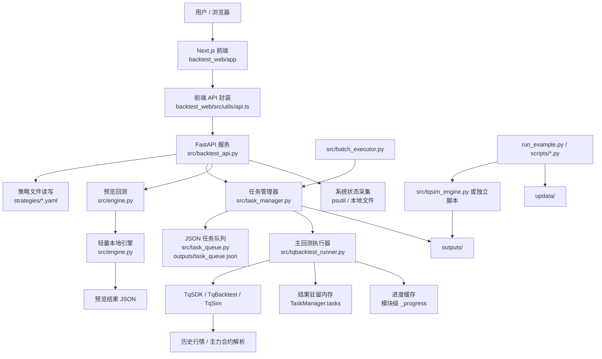
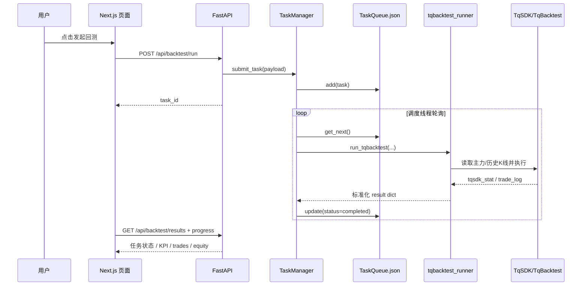
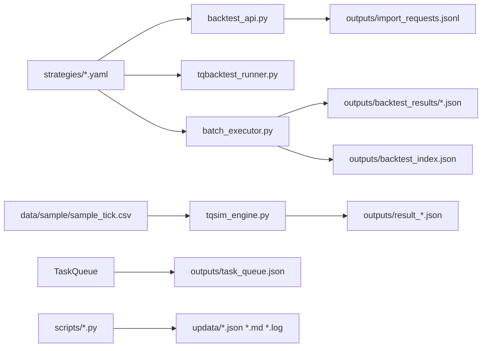
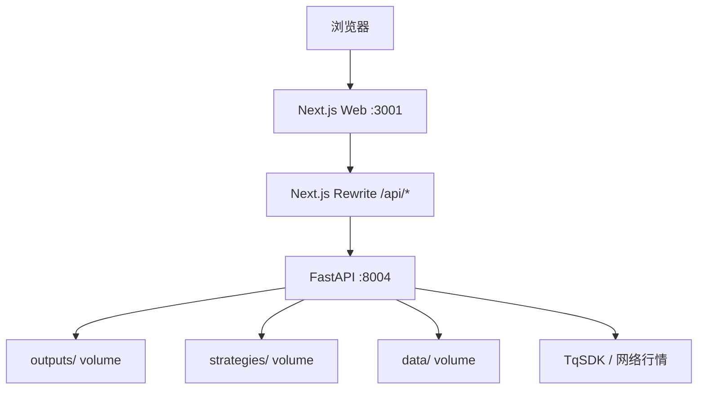
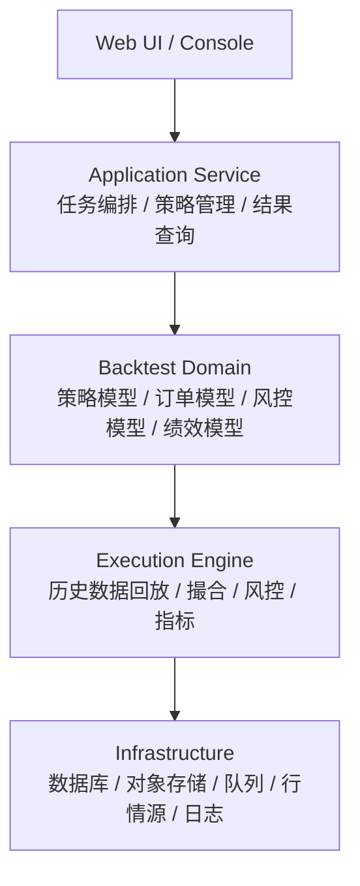

# 当前回测项目架构图

更新时间：2026-04-03

## 1. 现状总览

这个项目当前不是一条单一、闭环的回测架构，而是几条并行演化出来的执行路径叠在一起：

1. Web UI 路径：Next.js 页面通过浏览器调用 FastAPI。
2. 任务调度路径：FastAPI 把回测任务丢给 TaskManager，再由 TaskQueue 轮询执行。
3. 主回测路径：TaskManager 调用 `src/tqbacktest_runner.py`，用 TqSDK 的 TqBacktest 做历史回测。
4. 本地预览路径：`/api/backtest/adjust` 不走主回测器，而是用 `src/engine.py` 的轻量引擎跑一段合成价格序列。
5. 独立脚本路径：`run_example.py` 和 `scripts/*.py` 可以绕开 Web/API，直接本地或在线执行。
6. 批量路径：`src/batch_executor.py` 直接扫 `strategies/`，再通过 TaskManager 提交批量回测。

结论：当前系统的核心问题不是模块不够，而是执行入口过多、语义不一致、结果落盘位置不统一。

---

## 2. 总体逻辑架构图

---

## 3. 前端页面结构

### 3.1 页面入口

- `backtest_web/app/page.tsx`
  - 整个 Web 控制台外壳。
  - 包含左侧导航、顶部工具栏、全局刷新、运行中任务进度。
  - 当前主导航实际上只挂了两个入口：
    - `agents` -> `backtest_web/app/agent-network/page.tsx`
    - `operations` -> `backtest_web/app/operations/page.tsx`

### 3.2 页面职责

- `backtest_web/app/agent-network/page.tsx`
  - 策略管理中心。
  - 负责导入策略、查看策略列表、修改参数、选择主力合约、发起回测、取消任务。

- `backtest_web/app/operations/page.tsx`
  - 回测结果详情页。
  - 负责查看任务列表、读取单次回测结果、展示权益曲线和交易明细、导出 Markdown 报告。

- `backtest_web/app/command-center/page.tsx`
  - 仪表盘页。
  - 聚合 summary、results、equity、market quotes、system status。
  - 这个页面存在，但当前外层主导航没有直接挂载到首页外壳。

- `backtest_web/app/systems/page.tsx`
  - 本机系统状态页。
  - 展示 CPU、内存、磁盘、网络延迟、服务状态、系统日志。

- `backtest_web/app/intelligence/page.tsx`
  - 运行洞察页。
  - 用于展示策略数量、任务状态和系统资源摘要。

### 3.3 前端 API 适配层

- `backtest_web/src/utils/api.ts`
  - 统一封装浏览器请求。
  - 浏览器端通过 Next.js rewrite 用相对路径访问 `/api/*`。
  - 服务端渲染时直接走 `BACKEND_BASE_URL`。

### 3.4 前端与后端的当前漂移点

前端 API 封装里还保留了部分后端没有实现的接口：

- `/api/backtest/equity-curve`
- `/api/market/quotes`

`command-center` 页面已经对这类 404 做了降级容错，但从架构上看，这说明前后端契约已经发生漂移。

---

## 4. 后端 API 架构

后端核心入口只有一个文件：`src/backtest_api.py`。

它承担了过多职责：

1. HTTP 路由层
2. 策略 YAML 修复与标准化
3. 主力合约解析与 Tq 探测
4. 任务提交与结果查询
5. 本地预览回测
6. 系统资源状态采集
7. 回测摘要和历史查询

### 4.1 API 分组

#### 回测任务接口

- `POST /api/backtest/submit`
- `POST /api/backtest/run`
- `GET /api/backtest/status/{task_id}`
- `GET /api/backtest/result/{task_id}`
- `GET /api/backtest/results`
- `GET /api/backtest/results/{task_id}`
- `GET /api/backtest/results/{task_id}/equity`
- `GET /api/backtest/results/{task_id}/trades`
- `GET /api/backtest/progress/{task_id}`
- `POST /api/backtest/cancel/{task_id}`
- `POST /api/backtest/batch-delete`
- `DELETE /api/backtest/results/batch`
- `GET /api/backtest/summary`
- `GET /api/backtest/history/{strategy_id}`

#### 策略文件接口

- `POST /api/strategy/import`
- `DELETE /api/strategy/{name}`
- `GET /api/strategy/export/{name}`
- `GET /api/strategies`

#### 市场与系统接口

- `GET /api/market/main-contracts`
- `GET /api/system/status`
- `GET /api/system/logs`
- `GET /health`

#### 特殊预览接口

- `POST /api/backtest/adjust`
  - 不走主任务调度链。
  - 读取策略后，在接口内部直接组一段合成价格序列，再调用 `BacktestEngine` 做快速预览。

---

## 5. 回测执行架构

### 5.1 主执行链

### 5.2 主执行器

- `src/task_manager.py`
  - 常驻线程调度器。
  - 管理内存中的任务状态。
  - 从 `TaskQueue` 读取 pending 任务。
  - 控制最大并发数 `max_concurrent=3`。

- `src/task_queue.py`
  - JSON 持久化队列。
  - 文件位置：`outputs/task_queue.json`
  - 只支持本机单实例，不具备分布式锁或外部消息队列能力。

- `src/tqbacktest_runner.py`
  - 当前主回测执行器。
  - 负责：
    - 从 `strategies/` 读取 YAML
    - 归一化 symbol 为主力连续
    - 按策略 category 判定趋势或反转模式
    - 调用 TqSDK TqBacktest 做历史回测
    - 生成 KPI、权益曲线、逐笔成交
  - 当前实际读取的是 YAML 的一部分字段，不同类型策略都被压到一套通用执行模板里。

### 5.3 预览执行链

- `POST /api/backtest/adjust`
  - 不使用 TqBacktest。
  - 直接在接口里拼接合成价格序列。
  - 调用 `src/engine.py` 的 `BacktestEngine`。
  - 返回 preview JSON。

这条链与主回测链的市场数据、撮合逻辑、性能指标来源都不一致，因此预览结果不能等价视为正式回测结果。

### 5.4 轻量引擎链

- `src/engine.py`
  - 一个非常简化的本地回测器。
  - 基于 DataFrame 逐行喂价。
  - 支持简单买卖、滑点、手续费。
  - 用于：
    - 示例
    - 单元测试
    - 调整预览

- `src/tqsim_engine.py`
  - 一个兼容适配层。
  - 有两种模式：
    - `use_local_data=True`：读 `data/sample/sample_tick.csv`
    - `use_local_data=False`：调用 TqSDK/TqSim 在线数据
  - 最终仍然把数据喂给 `BacktestEngine`。

所以这个项目里实际存在两套回测思想：

1. TqBacktest 原生回测路径
2. DataFrame 驱动的轻量回测路径

这两套结果天然不可直接混用。

---

## 6. 数据与文件落盘结构

### 6.1 主要目录职责

- `strategies/`
  - 策略 YAML 文件仓库。
  - Web 导入策略时会真正落盘到这里。

- `outputs/`
  - 系统主目录里的运行工件区。
  - 当前已知用途：
    - `task_queue.json`
    - `import_requests.jsonl`
    - `result_*.json`
    - `backtest_results/*.json`
    - `backtest_index.json`

- `updata/`
  - 偏人工报告与交付目录。
  - 独立脚本跑出来的 Markdown、JSON、日志目前主要写这里。

- `data/sample/`
  - 本地样本行情。
  - 仅供轻量引擎或本地模拟路径使用。

- `docs/`
  - API 文档、OpenAPI、部署文档。

### 6.2 当前落盘不一致问题

这个系统现在至少有三种结果落盘方式：

1. `TaskManager + tqbacktest_runner`：结果主要放在内存中的 `manager.tasks[task_id].result`
2. `TqSimEngine`：写 `outputs/result_{task_id}.json`
3. 独立脚本：写 `updata/*.json`、`updata/*.md`、`updata/*.log`

这意味着：

- 前端查询结果主要依赖内存态任务；
- 历史接口 `backtest_history` 又倾向从 `outputs/result_*.json` 扫文件；
- 人工分析报告又在 `updata/`。

这是当前架构最明显的割裂点之一。

---

## 7. 部署架构

### 7.1 开发态

- 根目录 `docker-compose.yml` 只定义了一个后端容器：`botquant-backtest`
- 默认暴露端口：`8004`
- 前端常常以本地 Node 进程独立运行在 `3001`

### 7.2 生产态

`docker-compose.prod.yml` 里是双容器：

1. `botquant-backtest-api`
   - FastAPI
   - 端口 `8004`
   - 挂载 `outputs/`、`strategies/`、`data/`

2. `botquant-backtest-web`
   - Next.js
   - 端口 `3001`
   - 通过 `BACKEND_BASE_URL` 指向 API 容器

### 7.3 部署拓扑图

### 7.4 容器入口

- 根目录 `Dockerfile`
  - Python 3.11 slim
  - 入口脚本 `entrypoint.sh`

- `entrypoint.sh`
  - 若传入命令则直接执行
  - 否则默认跑 `python run_example.py`

这说明根镜像本身既可以当 API 容器，也可以退化成示例执行容器。

---

## 8. 当前模块职责表

| 模块 | 主要职责 | 当前问题 |
|------|----------|----------|
| `backtest_web/app` | 页面层、控制台 UI | 页面存在但导航不统一，部分页面已脱离首页主导航 |
| `backtest_web/src/utils/api.ts` | 前端 API 契约层 | 有接口漂移，部分 endpoint 未在后端实现 |
| `src/backtest_api.py` | 后端总入口 | 单文件承担过多职责，业务边界不清晰 |
| `src/task_manager.py` | 任务调度与状态管理 | 结果主要在内存里，重启丢失上下文风险高 |
| `src/task_queue.py` | JSON 持久化队列 | 仅适合单机单实例，不适合横向扩展 |
| `src/tqbacktest_runner.py` | 主历史回测执行器 | 把多类策略压成通用模板，YAML 语义丢失 |
| `src/engine.py` | 轻量本地引擎 | 与主回测器结果口径不一致 |
| `src/tqsim_engine.py` | 在线/本地数据适配层 | 实际又回退到轻量引擎，职责模糊 |
| `src/batch_executor.py` | 批量扫策略并执行 | 与 Web/API 流程重复，结果另存一套目录 |
| `src/strategy_importer.py` | 策略导入报告处理 | 功能很薄，但名字容易让人误以为是完整导入域服务 |
| `strategies/` | 策略配置仓库 | 既是输入源，又被 API 直接修改 |
| `outputs/` | 系统工件目录 | 队列、历史、索引、结果混放 |
| `updata/` | 人工报告与独立脚本产物 | 与 outputs 并存，语义重叠 |

---

## 9. 当前架构的关键耦合点

### 9.1 策略配置耦合

- Web 页面直接编辑 YAML 内容。
- 后端导入时会自动修复 YAML。
- `_fix_strategy_yaml()` 会强制写入 `initial_capital = 200000`。
- 也就是说，策略文件既是用户配置，又被系统当成可变对象直接覆盖。

### 9.2 执行语义耦合

- 同一个“回测”动作，在不同入口会走不同引擎：
  - 正式任务 -> `tqbacktest_runner`
  - 调整预览 -> `engine.py`
  - 示例/在线调试 -> `tqsim_engine.py`
  - 独立脚本 -> `scripts/*.py`

### 9.3 结果查询耦合

- 列表页读 `manager.tasks`
- 历史页扫 `outputs/result_*.json`
- 批量执行器写 `outputs/backtest_results/*.json`
- 分析报告写 `updata/*.md`

用户看到的“一个回测系统”，在文件层面其实是四套结果组织方式。

### 9.4 运行状态耦合

- 系统状态页既读 API，又依赖本机 `psutil`。
- 服务状态是通过进程名模糊匹配 `uvicorn/python/node/docker` 推断的，不是独立服务注册机制。

---

## 10. 重构时最值得保留的部分

如果要重写，不建议全盘否定。当前系统里仍有几块可以直接保留思路：

1. `strategies/` 作为策略配置仓库的概念可以保留。
2. `TaskQueue + TaskManager` 这套“提交任务 / 查询进度 / 查询结果”的交互模型可以保留，但底层实现应重做。
3. `backtest_web` 的页面拆分方式可以保留为重构原型：
   - 策略管理
   - 回测结果
   - 系统状态
4. `docker-compose.prod.yml` 的前后端双容器部署方式是清晰的，可以直接沿用。

---

## 11. 重构时建议直接拆成的新边界

建议重做时按下面五层拆分：

### 建议原则

1. 一个正式回测入口，只允许对应一个正式执行引擎。
2. 预览回测如果保留，必须明确标注为“近似预览”，不能混入正式结果。
3. 策略配置、任务状态、回测结果、报告文件要统一落盘语义。
4. 风控、撮合、绩效不要散落在 API、脚本、页面里，应该收回到执行域。
5. 前后端契约必须集中管理，避免页面静默兼容不存在的接口。

---

## 12. 当前项目一句话结论

当前项目的真实形态不是“一个完整回测系统”，而是“一个 Web 控制台 + 一个 FastAPI 汇总入口 + 多条并行执行链 + 多套结果落盘方式”的混合体。它已经能跑，但边界不清，所以继续在现状上叠功能会越来越难维护；如果要重写，最优策略不是补丁式整理，而是先统一执行引擎、结果存储和 API 契约，再把 UI 挂回一个稳定的领域模型上。