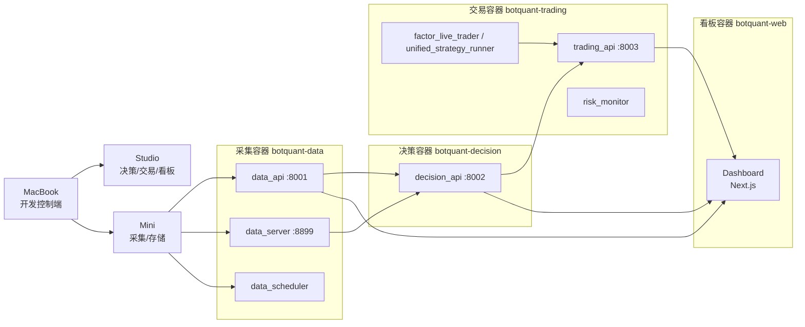
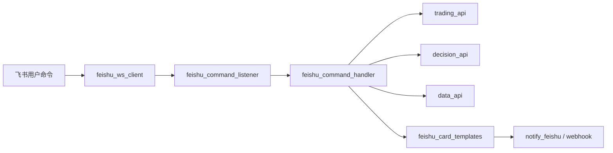
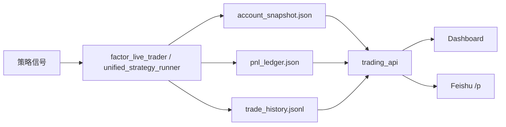

# BotQuant 全系统架构图与脚本清单

**版本：** v1.0  
**更新日期：** 2026-03-27  
**适用范围：** MacBook 开发端、Studio 交易/决策/看板端、Mini 数据采集/存储端  
**维护级别：** ALL Agent 强制必读

---

## 0. 维护前置规则

### 强制规则

1. 任何 Agent 在维修、安装、改配置、重启服务之前，必须先读：
   - `Atlas_prompt.md`
   - `PROJECT_CONTEXT.md`
   - 本文档
2. 未完成现状核查前，禁止直接维修。
3. 未经 Jay.S 确认，禁止新增系统级服务、禁止改运行拓扑、禁止改目录结构、禁止改关键配置。
4. TqSim 三个关键文件只允许 append-only，不允许清空、重建、覆盖历史：
   - `BotQuan_Data/tqsim/account_snapshot.json`
   - `BotQuan_Data/tqsim/pnl_ledger.json`
   - `BotQuan_Data/tqsim/trade_history.jsonl`

### 本文档的判定口径

- “现状”优先依据当前仓库中的 launchctl 配置、脚本入口、API 架构文件、近期治理记录。
- “四容器”是 BotQuant 的标准逻辑拓扑。
- “当前运行现状”是 launchctl 守护 + 部分容器规划并存的混合部署，不允许把规划误写成现状。

---

## 1. 三设备总览

| 设备 | 系统角色 | 当前职责 | 不承载内容 |
|---|---|---|---|
| MacBook | 开发控制端 | 写代码、改配置、调度 AI Agent、查看文档、人工干预 | 不承载正式采集、不承载正式交易守护 |
| Studio | 决策 + 交易 + 看板端 | decision_api、trading_api、因子交易、风控、飞书交互、当前主看板 | 不承担 24x7 全量采集存储 |
| Mini | 数据采集 + 存储端 | data_api、data_server、data_scheduler、采集脚本、数据落盘、数据健康监控 | 不承担主交易执行 |

---

## 2. 四容器标准拓扑与当前现状

### 2.1 标准四容器拓扑

### 2.2 当前线上现状

| 逻辑端 | 标准容器名 | 当前主要运行方式 | 当前落点 |
|---|---|---|---|
| 采集端 | `botquant-data` | 以 launchctl + Python 守护为主 | Mini |
| 决策端 | `botquant-decision` | 以 launchctl + uvicorn 为主 | Studio |
| 交易端 | `botquant-trading` | 以 launchctl + Python/TqSim 为主 | Studio |
| 看板端 | `botquant-web` | Next.js:3000（Docker 容器）+ launchd 守护启动脚本 | Studio |

### 2.3 当前看板口径（强制）

- `docker-compose.yml` 定义了四容器：`botquant-data`、`botquant-decision`、`botquant-trading`、`botquant-web`。
- 当前线上看板唯一口径是 `botquant-web:3000`（Next.js，Docker）。
- `8501/Streamlit` 仅保留历史代码与历史文档语义，不得作为线上现状引用。

---

## 3. 关键通信链路

### 3.1 主业务链

1. Mini 采集脚本落盘到 `BotQuan_Data/`。
2. Mini 的 `data_api:8001` 和 `data_server:8899` 对外提供数据访问。
3. Studio 的 `decision_api:8002` 从 Mini 拉取数据并生成信号/风控判断。
4. Studio 的 `factor_live_trader.py` 或 `unified_strategy_runner.py` 执行 TqSim 模拟交易。
5. Studio 的 `trading_api:8003` 输出账户、持仓、盈亏、成交、日汇总。
6. 看板与飞书命令统一查询 `trading_api` / `decision_api` / `data_api`。

### 3.2 飞书链路

### 3.3 交易账簿链路

---

## 4. Studio 端系统清单

### 4.1 Studio 常驻核心服务

| Label / 程序 | 中文注释名 | 入口脚本/模块 | 作用 | 关联关系 | 主要落档位置 |
|---|---|---|---|---|---|
| `com.botquant.decision_api` | 决策 API 服务 | `src.api.decision_api:app` | 提供因子、信号、回测、风控查询接口 | 读取 Mini 数据；向交易端提供决策/审批 | 日志由 plist 标准输出/错误输出落盘 |
| `com.botquant.trading_api` | 交易 API 服务 | `src.api.trading_api:app` | 提供订单、持仓、盈亏、成交、day-summary | 读取 TqSim 快照/live state；供看板/飞书调用 | 依赖 `BotQuan_Data/tqsim/` 三文件 |
| `com.botquant.factor.trader` | 因子实盘交易主进程 | `scripts/factor_live_trader.py` | 单账户因子策略执行、风控、强平、飞书交易通知 | 调 `decision_api` 做 AI 审批；写 `trading_api` 所需快照 | `BotQuan_Data/tqsim/account_snapshot.json`、`BotQuan_Data/tqsim/pnl_ledger.json`、`BotQuan_Data/tqsim/trade_history.jsonl` |
| 非默认守护但关键 | 统一策略聚合执行器 | `scripts/unified_strategy_runner.py` | 全量 FC 并行聚合、单一 TqSim、多线程信号融合 | `trading_api` 优先读取其 `8011/live` 内存态 | `BotQuan_Data/tqsim/`、`BotQuan_Data/logs/unified_runner/` |
| `com.botquant.risk_monitor` | 主动风控巡检守护 | `scripts/risk_monitor.py` | 每 60 秒巡检日亏、集中度、连续亏损、回撤；检测 Mini 连通性 | 调 `trading_api` 本地盈亏；异常发飞书 P0/P1 | `logs/risk/alerts.jsonl` |
| `com.botquant.feishu_ws` | 飞书 WebSocket 主实例 | `src.monitor.feishu_ws_client` | 接收飞书消息、统一命令入口 | 调 command listener/handler/card template | plist 标准输出错误日志 |
| `com.botquant.daily_audit` | 每日主动核查 | `scripts/daily_audit.py` | 按设备角色巡检服务、目录新鲜度、代理状态、健康项 | Studio/Mini 都可用；是运维审计入口 | `BotQuan_Data/logs/daily_audit.log`、`BotQuan_Data/logs/audit_findings.log` |
| `com.botquant.storage.alert.studio` | Studio 存储告警 | `scripts/storage_alert.sh` | 检查磁盘空间阈值并告警 | 配合 daily_audit、备份策略 | 相关 shell 日志由 plist 落盘 |
| `com.botquant.backup.weekly.studio` | Studio 每周备份 | `scripts/studio_backup_to_nas.sh` | 向 NAS 做例行备份 | 与 NAS、备份窗口联动 | 备份脚本日志由 plist 落盘 |

### 4.2 Studio 看板与飞书相关程序

| 程序 | 中文注释名 | 文件位置 | 作用 | 上游/下游 |
|---|---|---|---|---|
| `botquant-web` (Docker) | Next.js 主看板入口 | `docker-compose.yml` + `../J_BotQuant_Web` | 当前主看板入口，统一展示概览、交易、风控、数据状态 | 下游调用 `data_api`、`decision_api`、`trading_api` |
| `src/monitor/feishu_command_listener.py` | 飞书命令监听器 | `src/monitor/feishu_command_listener.py` | 统一接收 `/p` 等命令并包装 card 回复 | 上游 `feishu_ws_client`，下游 handler/template |
| `src/monitor/feishu_command_handler.py` | 飞书命令处理器 | `src/monitor/feishu_command_handler.py` | 拉取 position/day-summary/pnl 等数据并格式化业务结果 | 下游调用 `trading_api`、`decision_api` |
| `src/monitor/feishu_card_templates.py` | 飞书卡片模板中心 | `src/monitor/feishu_card_templates.py` | 统一生成持仓卡、交易卡、简单信息卡 | 被 listener/handler/notifier 共用 |
| `src/monitor/notify_feishu.py` | 飞书 webhook 发送器 | `src/monitor/notify_feishu.py` | 实际向不同 webhook 推送卡片消息 | 依赖 `feishu_config.py` |
| `src/monitor/feishu_config.py` | 飞书统一配置解析器 | `src/monitor/feishu_config.py` | 统一 trade/alert/news/macro/gov webhook 解析 | 所有飞书发送链统一入口 |
| `scripts/send_three_session_report.py` | 三时段交易汇总推送 | `scripts/send_three_session_report.py` | 从 `trading_api` 拉成交后生成早/午/夜卡片 | 下游交易群 webhook |

### 4.3 Studio 关键数据落档

| 路径 | 含义 | 写入者 |
|---|---|---|
| `BotQuan_Data/tqsim/account_snapshot.json` | 当日账户实时快照 | `factor_live_trader.py` / `unified_strategy_runner.py` |
| `BotQuan_Data/tqsim/pnl_ledger.json` | 跨日累计账本 | `factor_live_trader.py` / `unified_strategy_runner.py` |
| `BotQuan_Data/tqsim/trade_history.jsonl` | 全历史成交流水 | `factor_live_trader.py` / `unified_strategy_runner.py` |
| `logs/risk/alerts.jsonl` | 风控告警记录 | `risk_monitor.py` |
| `BotQuan_Data/logs/daily_audit.log` | 每日审计流水 | `daily_audit.py` |
| `BotQuan_Data/logs/audit_findings.log` | 审计发现结构化记录 | `daily_audit.py` |

---

## 5. Mini 端系统清单

### 5.1 Mini 常驻服务

| Label / 程序 | 中文注释名 | 入口脚本/模块 | 作用 | 关联关系 | 主要落档位置 |
|---|---|---|---|---|---|
| `com.botquant.data_scheduler` | 24h 数据调度总线 | `scripts/data_scheduler.py` | 按 cron 统一调度 11 类采集管道 | 触发宏观、新闻、波动率、情绪、持仓等采集 | `BotQuan_Data/logs/scheduler.log` |
| 独立 FastAPI | 数据 API 服务 | `src.api.data_api:app` | 提供 K 线、宏观、新闻、持仓、最新状态接口 | 供 Studio `decision_api`/看板读取 | 面向 `BotQuan_Data/parquet` 等数据目录 |
| 独立 FastAPI | 数据文件服务 | `src.api.data_server:app` | 提供 Parquet 数据查询与下载能力，端口 8899 | Studio 通过 HTTP 拉数据 | 面向 `BotQuan_Data/parquet` 根目录 |
| `com.botquant.mini_monitor` 或等价守护 | Mini 自监控 | `scripts/mini_monitor.py` | 监控 CPU/内存/磁盘/进程/网络/温度并飞书告警 | 与 daily_audit 协同 | `logs/mini_monitor.log`、`logs/mini_monitor.pid` |
| `com.botquant.storage.alert.mini` | Mini 存储空间告警 | `scripts/storage_alert.sh` | 存储阈值检查与告警 | 与 NAS 备份、daily_audit 协同 | plist 输出日志 |
| `com.botquant.backup.weekly.mini` | Mini 每周备份 | `scripts/mini_backup_weekly.sh` | 将采集数据例行备份 | 与 NAS/外接盘联动 | plist 输出日志 |
| `com.botquant.daily_audit` | 分布式日审计 | `scripts/daily_audit.py` | 识别 Mini 角色后检查采集守护、目录新鲜度、代理状态 | 汇总到审计日志 | `BotQuan_Data/logs/daily_audit.log` |

### 5.2 Mini 定时采集 / 调度脚本

| Label / 程序 | 中文注释名 | 入口脚本 | 作用 | 上下游关系 | 主要落档位置 |
|---|---|---|---|---|---|
| `com.botquant.futures.minute` | 国内期货分钟线调度 | `scripts/futures_minute_scheduler.py --live` | 盘中采集主力合约与连续合约 1m 数据 | 上游 TqSdk；下游因子/回测/决策 | `BotQuan_Data/futures_minute/1m/` |
| `com.botquant.futures.eod` | 国内期货盘后补采 | `scripts/futures_minute_scheduler.py --eod` | 盘后回补完整分钟线与连续合约 | 补足盘中采集缺口 | 同上 |
| `com.botquant.overseas.minute` | 外盘分钟线调度 | `scripts/overseas_minute_scheduler.py --live` | 采集海外商品对应品种分钟线 | 上游 yfinance/Twelve Data；供海外映射因子使用 | `BotQuan_Data/overseas_kline/1m/`、`5m/` |
| `com.botquant.overseas.daily` | 外盘日线调度 | `scripts/overseas_minute_scheduler.py --daily` | 每日回补海外品种日线 | 下游因子/宏观联动分析 | `BotQuan_Data/overseas_kline/1d/` |
| `com.botquant.stock.minute` | A 股分钟线盘后采集 | `scripts/stock_minute_scheduler.py --daily` | 盘后采集全部 A 股 5m 数据 | 上游东方财富/AkShare；下游 watchlist/因子 | `BotQuan_Data/stock_minute/5m/` |
| `com.botquant.stock.realtime` | A 股实时 watchlist 采集 | `scripts/stock_minute_scheduler.py --realtime` | 盘中采集 watchlist TopN 的 1m 数据 | 依赖 `configs/watchlist.json` | `BotQuan_Data/stock_minute/1m/` |
| `com.botquant.watchlist` | 动态自选股生成器 | `scripts/watchlist_manager.py` | 基于多因子扫描 A 股并输出次日监控池 | 下游驱动 `stock.realtime` | `configs/watchlist.json`、`BotQuan_Data/logs/watchlist_history.jsonl` |
| `com.botquant.tushare` | Tushare 日级调度 | `scripts/tushare_daily_scheduler.py` | 拉 A 股、期货、日历等 Tushare 数据 | 下游给 watchlist、数据 API、研究任务 | `BotQuan_Data/tushare/` |
| `com.botquant.position.daily` | 持仓/仓单/基差日调度 | `scripts/position_scheduler.py --daily` | 采集持仓排名、仓单、基差日频数据 | 下游风控/基本面因子 | `BotQuan_Data/position/holding_rank/`、`warehouse/`、`basis/` |
| `com.botquant.position.weekly` | 持仓/库存周调度 | `scripts/position_scheduler.py --weekly` | 采集国内库存、全球库存、CFTC/LME | 下游基本面因子 | `BotQuan_Data/position/inventory_cn/`、`inventory_global/`、`cftc_lme/` |
| `com.botquant.volatility` | 波动率总调度 | `scripts/volatility_scheduler.py` | 采集 15 个波动率指标 | 下游 ImpliedVolatility 等因子 | `BotQuan_Data/volatility_index/volatility/` |
| `com.botquant.volatility.qvix` | 国内 QVIX 波动率 | `scripts/volatility_scheduler.py` | 采集 A 股 QVIX 系列 | 下游波动率因子 | 同上 |
| `com.botquant.volatility.cboe` | 海外 CBOE 波动率 | `scripts/volatility_scheduler.py` | 采集 VIX/VXN/VVIX/GVZ/OVX/MOVE | 下游商品波动率与风险分析 | 同上 |
| `com.botquant.sentiment` | 情绪指数采集 | `scripts/sentiment_scheduler.py` | 采集市场情绪相关指标 | 下游情绪因子/看板 | `BotQuan_Data/sentiment/` |
| `com.botquant.weather` | 天气数据采集 | `scripts/weather_scheduler.py` | 采集天气与气候影响数据 | 下游农产品与能源因子 | `BotQuan_Data/weather/` |
| `com.botquant.shipping` | 航运数据采集 | `scripts/shipping_scheduler.py` | 采集海运/物流指标 | 下游黑色系/能化基本面 | `BotQuan_Data/shipping/` |
| `com.botquant.macro` | 宏观数据守护包装器 | `scripts/run_wrapped_macro.sh` -> `scripts/macro_scheduler.py` | 运行宏观调度器并补发健康报告 | 下游宏观数据查询、看板 | `BotQuan_Data/macro_global/`、`BotQuan_Data/logs/macro_daemon.log` |
| `com.botquant.news` | 新闻采集守护包装器 | `scripts/run_wrapped_news.sh` -> `scripts/news_scheduler.py` | 运行新闻 API/RSS 聚合采集 | 下游新闻数据、情绪分析、飞书摘要 | `BotQuan_Data/news_api/`、`news_rss/`、`news_collected/`、`BotQuan_Data/logs/news_daemon.log` |
| `com.botquant.health` | Mini 健康自检 | `scripts/health_check.py` | 做系统自检与状态报告 | 与 daily_audit/mini_monitor 协同 | 以日志和报告为主 |
| `com.botquant.dashboard` | 看板守护入口 | `/Users/jaybot/J_BotQuant_Web/scripts/start_dashboard.sh` | 当前通过 launchd 触发 Docker compose 前台守护 `botquant-web` | 统一启动 Next.js 看板容器，避免 node 直跑偏差 | 看板日志落盘到 `J_BotQuant_Web/logs/` |

### 5.3 Mini 数据目录地图

| 目录 | 数据类型 | 主要写入脚本 |
|---|---|---|
| `BotQuan_Data/futures_minute/` | 国内期货分钟线 | `futures_minute_scheduler.py` |
| `BotQuan_Data/overseas_kline/` | 外盘分钟/日线 | `overseas_minute_scheduler.py` |
| `BotQuan_Data/stock_minute/` | A 股分钟线 | `stock_minute_scheduler.py` |
| `BotQuan_Data/tushare/` | Tushare 股票/期货/日历等 | `tushare_daily_scheduler.py` |
| `BotQuan_Data/position/` | 持仓、仓单、基差、库存 | `position_scheduler.py` |
| `BotQuan_Data/volatility_index/` | 波动率指数 | `volatility_scheduler.py` |
| `BotQuan_Data/sentiment/` | 情绪数据 | `sentiment_scheduler.py` |
| `BotQuan_Data/weather/` | 天气数据 | `weather_scheduler.py` |
| `BotQuan_Data/shipping/` | 航运与物流数据 | `shipping_scheduler.py` |
| `BotQuan_Data/macro_global/` | 宏观数据 | `macro_scheduler.py` |
| `BotQuan_Data/news_api/` | 新闻 API 数据 | `news_scheduler.py` / `news_api_collector.py` |
| `BotQuan_Data/news_rss/` | RSS 新闻数据 | `news_scheduler.py` / `rss_collector.py` |
| `BotQuan_Data/news_collected/` | 聚合后新闻归档 | `news_scheduler.py` |
| `BotQuan_Data/logs/` | 采集/守护/审计日志 | 各守护/脚本 |

---

## 6. 关键程序关联关系

### 6.1 决策到交易

| 上游 | 下游 | 关系 |
|---|---|---|
| `src.api.data_api` / `src.api.data_server` | `src.api.decision_api` | 决策端读取数据端数据 |
| `src.api.decision_api` | `scripts/factor_live_trader.py` | AI 审批、信号辅助、风控判断 |
| `scripts/unified_strategy_runner.py` | `src.api.trading_api` | `trading_api` 优先读取 live state server `:8011/live` |
| `scripts/factor_live_trader.py` | `src.api.trading_api` | 通过快照与账簿暴露账户状态 |

### 6.2 交易到展示

| 上游 | 下游 | 关系 |
|---|---|---|
| `src.api.trading_api` | `botquant-web` | 看板读取账户、持仓、成交、盈亏 |
| `src.api.trading_api` | `src/monitor/feishu_command_handler.py` | `/p`、`/pnl`、`/position` 查询 |
| `scripts/send_three_session_report.py` | 飞书交易群 | 三时段交易汇总卡片 |

### 6.3 采集到策略

| 采集数据 | 下游使用方 |
|---|---|
| `futures_minute` | 期货因子、回测、实时信号 |
| `overseas_kline` | 海外映射因子、宏观联动 |
| `tushare` | A 股研究、watchlist、交易日历 |
| `position` | 基本面因子、风控观察 |
| `volatility_index` | 波动率因子、风险状态 |
| `news_*` / `sentiment` | 情绪因子、看板、飞书摘要 |
| `weather` / `shipping` / `macro_global` | 农产品、能化、宏观因子 |

---

## 7. 维护操作红线

1. 不允许跳过 `Atlas_prompt.md` 和 `PROJECT_CONTEXT.md` 直接修。
2. 不允许把 `8501/Streamlit` 误当成当前线上主看板。
3. 不允许在未取证前删除或新增 launchctl 服务。
4. 不允许对 `BotQuan_Data/tqsim/` 三关键账簿文件做清空式操作。
5. 不允许在 MacBook 本地私自运行正式采集任务替代 Mini。
6. 不允许在 Studio/Mini 上拉起重复飞书实例。

---

## 8. 维护顺序建议

1. 先读 `Atlas_prompt.md`。
2. 再读 `PROJECT_CONTEXT.md`。
3. 再读本文确认现状/规划边界。
4. 核查目标服务当前是否已存在：launchctl、端口、进程、配置、日志。
5. 给出“已配置 / 未配置 / 重复配置 / 冲突配置”结论。
6. 经 Jay.S 确认后，才允许维修或新增。

---

## 9. 当前结论

- BotQuant 当前正式运行架构是“三设备 + 四逻辑端 + launchctl + Docker（web）”的混合部署。
- Studio 是交易、决策、飞书交互和当前主看板中心（Next.js:3000）。
- Mini 是唯一正式数据采集与数据存储中心。
- MacBook 是开发与控制台，不应承载正式生产采集或正式生产交易守护。
- 所有后续 Agent 的维修动作，都必须以本文档、`Atlas_prompt.md`、`PROJECT_CONTEXT.md` 三者一致为准。

## 10. 变更/添加/删减任务清单（2026-03-27 20:45）

- 更改：拓扑图看板节点由 `Streamlit/Next.js` 改为 `Next.js`。
- 更改：看板运行现状改为 `botquant-web:3000`（Docker）。
- 更改：Studio 看板服务表改为 Docker/launchd 组合守护说明。
- 更改：交易到展示链路从 `src/dashboard/app.py` 改为 `botquant-web`。
- 删减：`8501/Streamlit` 作为现状描述。
